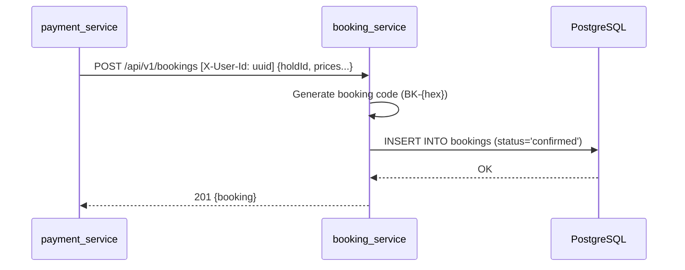

# Booking Service — Architecture

## Overview

The Booking Service manages confirmed reservation records. It receives pre-calculated booking data (from the payment service, after successful payment) and persists it as a confirmed booking. It does **not** create holds or interact with the Inventory Service — that responsibility belongs to the Cart Service.

In the Cart = Hold architecture:
1. `cart_service` creates a hold via `inventory_service` when the user selects a room
2. `payment_service` (future) processes payment against the cart
3. `booking_service` records the confirmed reservation

## Domain Model

```
Booking
├── code        (unique, e.g. "BK-8072EF8D")
├── status      (confirmed → cancelled/past)
├── hold_id     (UUID ref to inventory_service hold)
├── room_id     (UUID ref to inventory_service room)
├── hotel_id    (UUID ref to inventory_service hotel)
└── user_id     (UUID ref to auth_service user)
```

All foreign references are UUIDs without FK constraints (cross-service boundary).

## Database Schema

### `bookings`
| Column | Type | Notes |
|--------|------|-------|
| id | UUID | PK |
| code | VARCHAR(20) | UNIQUE, auto-generated `BK-{hex}` |
| user_id | UUID | cross-service ref |
| hotel_id | UUID | cross-service ref |
| room_id | UUID | cross-service ref |
| hold_id | UUID | ref to inventory hold |
| check_in | DATE | |
| check_out | DATE | |
| guests | INTEGER | 1-10 |
| status | VARCHAR(20) | default `'confirmed'` |
| base_price | DECIMAL(10,2) | price_per_night x nights |
| tax_amount | DECIMAL(10,2) | base_price x tax_rate |
| service_fee | DECIMAL(10,2) | default `0` |
| total_price | DECIMAL(10,2) | base + tax + fee |
| currency | VARCHAR(3) | default `'COP'` |
| created_at | TIMESTAMPTZ | |
| updated_at | TIMESTAMPTZ | |

Alembic version table: `alembic_version_booking` (isolated from other services sharing the same DB).

## API Endpoints

All endpoints that require user identification use the `X-User-Id` header (UUID).

| Method | Path | Headers | Description | Response |
|--------|------|---------|-------------|----------|
| POST | `/api/v1/bookings` | `X-User-Id` | Create a confirmed booking | 201 |
| GET | `/api/v1/bookings/{id}` | — | Booking detail | 200 / 404 |
| GET | `/api/v1/bookings` | `X-User-Id` | List user's bookings | 200 |
| GET | `/health` | — | Health check | 200 |

### POST /api/v1/bookings — Request

Price data is pre-calculated by the caller (cart_service/payment_service). The booking service does not call inventory or compute prices.

```json
{
  "roomId": "uuid",
  "hotelId": "uuid",
  "holdId": "uuid",
  "checkIn": "2026-04-01",
  "checkOut": "2026-04-03",
  "guests": 2,
  "basePrice": 500000.00,
  "taxAmount": 95000.00,
  "serviceFee": 0.00,
  "totalPrice": 595000.00
}
```

### POST /api/v1/bookings — Response (201)
```json
{
  "id": "uuid",
  "code": "BK-8072EF8D",
  "userId": "uuid",
  "status": "confirmed",
  "totalPrice": 595000.00,
  "currency": "COP",
  "createdAt": "2026-04-01T15:00:00Z"
}
```

## Sequence Diagram

### Booking Creation (Simple DB Insert)



## Configuration

| Env Variable | Default | Description |
|-------------|---------|-------------|
| `DATABASE_URL` | `postgresql+asyncpg://...localhost.../travelhub` | PostgreSQL connection |
