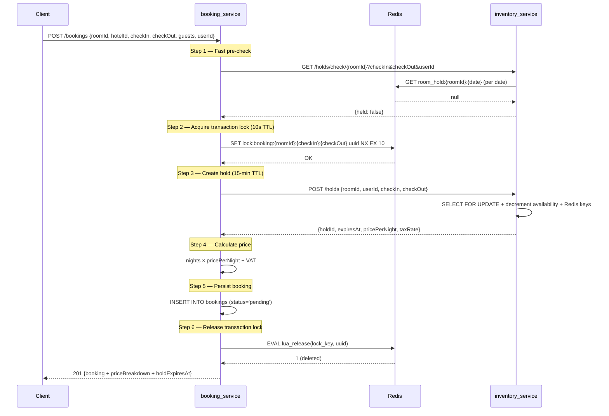
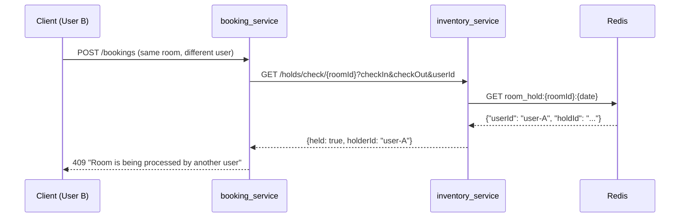
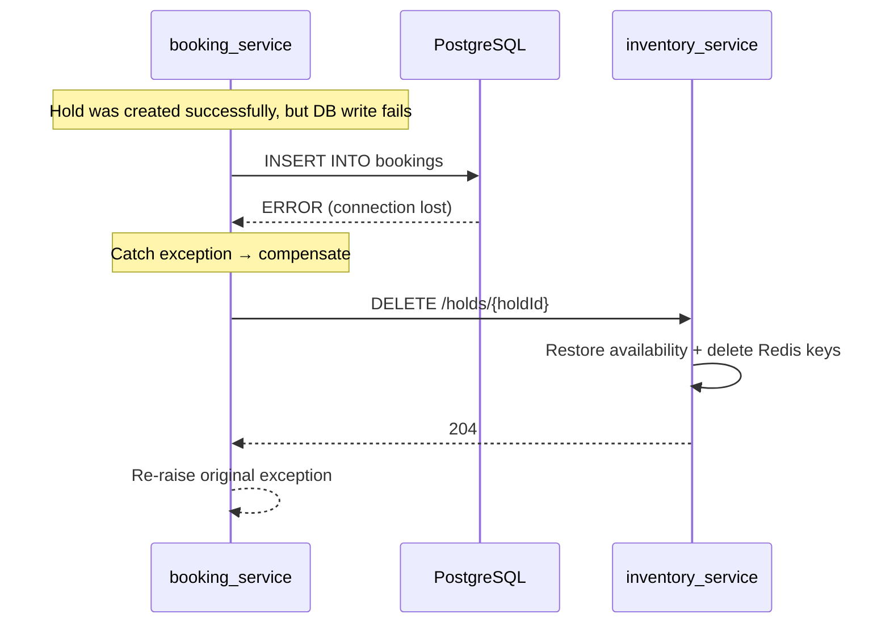

# Booking Service — Architecture

## Overview

The Booking Service orchestrates the reservation creation flow. It coordinates between the client, Redis (for transaction locks), and the Inventory Service (for availability holds). Its core responsibility is the **dual-lock booking pattern**: a short-lived Redis lock for atomicity + a 15-minute business hold via the Inventory Service.

This pattern was validated by a concurrency experiment: 50 simultaneous booking requests for the same room → exactly 1 succeeds (201), 49 receive conflict (409), 0 server errors.

## Domain Model

```
Booking
├── code        (unique, e.g. "BK-8072EF8D")
├── status      (pending → confirmed → cancelled/past)
├── hold_id     (UUID ref to inventory_service hold)
├── room_id     (UUID ref to inventory_service room)
├── hotel_id    (UUID ref to inventory_service hotel)
└── user_id     (UUID ref to auth_service user)
```

All foreign references are UUIDs without FK constraints (cross-service boundary).

## Database Schema

### `bookings`
| Column | Type | Notes |
|--------|------|-------|
| id | UUID | PK |
| code | VARCHAR(20) | UNIQUE, auto-generated `BK-{hex}` |
| user_id | UUID | cross-service ref |
| hotel_id | UUID | cross-service ref |
| room_id | UUID | cross-service ref |
| hold_id | UUID | ref to inventory hold |
| check_in | DATE | |
| check_out | DATE | |
| guests | INTEGER | 1–10 |
| status | VARCHAR(20) | default `'pending'` |
| base_price | DECIMAL(10,2) | price_per_night × nights |
| tax_amount | DECIMAL(10,2) | base_price × tax_rate |
| service_fee | DECIMAL(10,2) | default `0` |
| total_price | DECIMAL(10,2) | base + tax + fee |
| currency | VARCHAR(3) | default `'COP'` |
| created_at | TIMESTAMPTZ | |
| updated_at | TIMESTAMPTZ | |

Alembic version table: `alembic_version_booking` (isolated from other services sharing the same DB).

## Redis Key Patterns

| Key | TTL | Purpose |
|-----|-----|---------|
| `lock:booking:{roomId}:{checkIn}:{checkOut}` | 10s | Transaction lock — prevents race conditions during the atomic booking creation. Uses SET NX + Lua release. |

**Lock mechanism** (ported from experiment):
- **Acquire**: `SET key uuid NX EX 10` — atomic set-if-not-exists with 10s expiry
- **Retry**: 3 attempts with exponential backoff (0.1s, 0.2s, 0.4s)
- **Release**: Lua script `if GET(key) == uuid then DEL(key)` — prevents releasing another process's lock

## API Endpoints

| Method | Path | Description | Response |
|--------|------|-------------|----------|
| POST | `/bookings` | Create a reservation | 201 / 409 / 503 |
| GET | `/bookings/{id}` | Booking detail | 200 / 404 |
| GET | `/bookings?userId&status&page&limit` | List user's bookings | 200 |
| GET | `/health` | Health check | 200 |

### POST /bookings — Request
```json
{
  "roomId": "uuid",
  "hotelId": "uuid",
  "checkIn": "2026-04-01",
  "checkOut": "2026-04-03",
  "guests": 2,
  "userId": "uuid"
}
```

### POST /bookings — Response (201)
```json
{
  "id": "uuid",
  "code": "BK-8072EF8D",
  "status": "pending",
  "totalPrice": 595000.0,
  "currency": "COP",
  "holdExpiresAt": "2026-03-26T02:20:04Z",
  "priceBreakdown": {
    "pricePerNight": 250000.0,
    "nights": 2,
    "basePrice": 500000.0,
    "vat": 95000.0,
    "serviceFee": 0.0,
    "totalPrice": 595000.0
  }
}
```

## Sequence Diagrams

### Booking Creation — Full Flow (Dual-Lock Pattern)



### Concurrent Request — Conflict (409)



### Compensation on Failure



## Inter-Service Communication

| From | To | Method | Endpoint | Purpose |
|------|----|--------|----------|---------|
| booking | inventory | GET | `/holds/check/{roomId}` | Fast hold conflict check |
| booking | inventory | POST | `/holds` | Create 15-min hold |
| booking | inventory | DELETE | `/holds/{holdId}` | Release hold (compensation) |
| booking | inventory | GET | `/rooms/{roomId}` | Room details for pricing |

Communication is synchronous HTTP via `httpx.AsyncClient`. The `INVENTORY_SERVICE_URL` is configured via environment variable.

## Configuration

| Env Variable | Default | Description |
|-------------|---------|-------------|
| `DATABASE_URL` | `postgresql+asyncpg://...localhost.../travelhub` | PostgreSQL connection |
| `REDIS_URL` | `redis://localhost:6379/0` | Redis connection |
| `INVENTORY_SERVICE_URL` | `http://localhost:8006` | Inventory service base URL |
| `LOCK_TIMEOUT` | `10` | Transaction lock TTL in seconds |
| `LOCK_RETRY_ATTEMPTS` | `3` | Lock acquisition retry count |
| `LOCK_RETRY_DELAY` | `0.1` | Base delay for exponential backoff |
